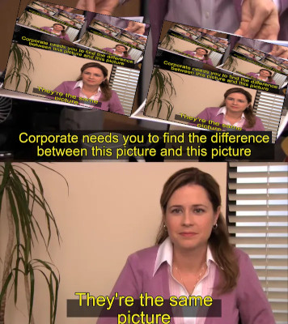

"Corporate needs you to find the difference" meme turned self-referential.



*   **SCALE** controls output image scale (currently 4).
*   **NUM_ITERATIONS** controls recursion depth (currently 8).

## Technical Approach
Treat the image as a recursive data structure. The script uses a linear-time approach ($O(iterations)$) to generate an exponential amount of nested detail ($2^n$ copies). 

### Key Features:
*   **Perspective Mapping:** Vertex mapping for the left and right papers on Pam's desk.
*   **Anti-Aliasing:** Gaussian pre-filtering (mip-mapping) to prevent moiré patterns during high-ratio perspective downscales.
*   **Floating Point Blending:** Uses `float32` accumulation and `INTER_LANCZOS4` interpolation to maintain fidelity across deep recursive layers.
*   **Difference-Masking:** Strategy to preserve the legibility of the caption text across all depth levels.

## Usage
```bash
source venv/bin/activate
python3 -m pip install -r requirements.txt
python generate_meme.py
```
